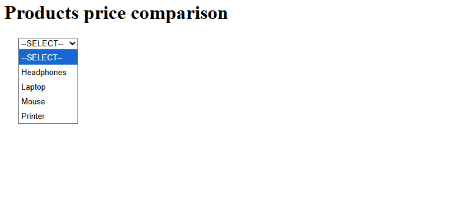
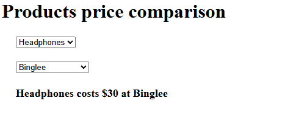

#  Dealer Evaluation App

An IBM Code Engine-based microservice application to compare product pricing from different dealers.

---


---

## 🚀 Deployed Microservices

| Microservice      | Description                 | URL                                                                 |
|-------------------|-----------------------------|---------------------------------------------------------------------|
| Product Details   | Lists available products     | [prodlist](https://prodlist.1xxgmbw3gkk7.us-south.codeengine.appdomain.cloud/)   |
| Dealer Pricing    | Pricing for selected dealer  | [dealerdetails](https://dealerdetails.1xxgmbw3gkk7.us-south.codeengine.appdomain.cloud/) |
| Frontend UI       | User interface               | [frontend](https://your-frontend-url/)                             |

---

## 📸 Screenshots

### 🟢 Homepage
> Dropdown populated with products



### 🟡 Dealer Selected
> Selected product and dealer with price



---

## 🛠 Tech Stack

- 🧠 Backend:
  - Python (Flask)
  - Node.js (Express)

- 🎨 Frontend:
  - HTML + JavaScript + Axios

- ☁️ Cloud:
  - IBM Code Engine
  - IBM Container Registry

---

## 📦 Build & Deploy Commands

```bash
# Deploy Product Details
ibmcloud ce application create --name prodlist \
  --image us.icr.io/${SN_ICR_NAMESPACE}/prodlist \
  --registry-secret icr-secret --port 5000 \
  --build-context-dir products_list \
  --build-source https://github.com/ibm-developer-skills-network/dealer_evaluation_backend.git

# Deploy Dealer Pricing
ibmcloud ce application create --name dealerdetails \
  --image us.icr.io/${SN_ICR_NAMESPACE}/dealerdetails \
  --registry-secret icr-secret --port 8080 \
  --build-context-dir dealer_details \
  --build-source https://github.com/ibm-developer-skills-network/dealer_evaluation_backend.git

# Deploy Frontend
ibmcloud ce application create --name frontend \
  --image us.icr.io/${SN_ICR_NAMESPACE}/frontend \
  --registry-secret icr-secret --port 5001 \
  --build-source .
```
## How to Use
1. Open the frontend link

2. Choose a product from the dropdown

3. Select a dealer or "All Dealers"

4. View the price comparison
